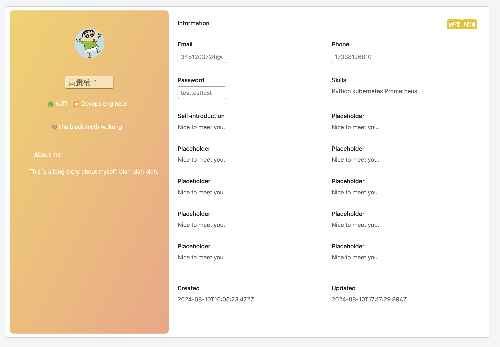
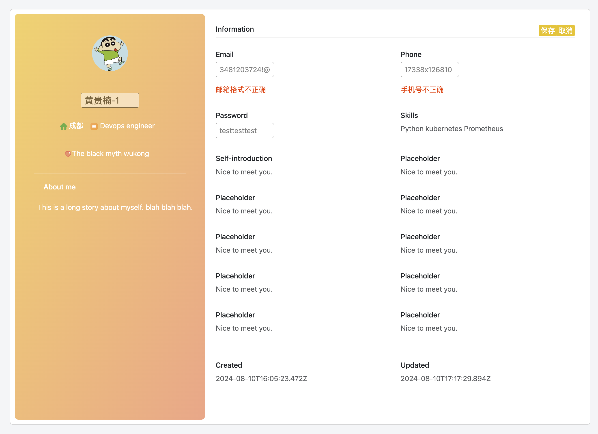

## Local Test
* vue :  
```
blocklet dev --mount-point /
```
* express : 
```
blocklet dev --app-did=<app-id> --mount-point /api/
```

## Deploy
* vue :  
```
yarn deploy --mount-point /
```
* express : 
```
yarn deploy:child --mount-point /api/
```

## Content Display
* Block server console


* User Profile page


* Edit mode and format validation


* When using phone


